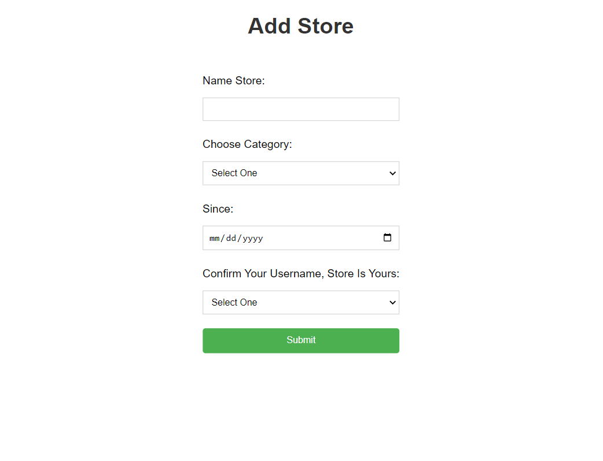

# PAIR-PROJECT-BUKA

## Deskripsi

-  Merupakan aplikasi sederhana bertema ecommerce atas tugas pair project Hacktiv8 phase1
-  Aplikasi dibuat dengan menggunakan

   -  Express
   -  Postgres
   -  Sequelize
   -  Bycryptjs
   -  Express-session
   -  EJS (Embedded JavaScript templating)

   ## setup

-  clone repo
   `git clone https://github.com/rohimjoy70/PAIR-PROJECT-OTW-BUKA.git`
-  create database
   `npx sequelize db:create`
-  migrate table
   `npx sequelize db:migrate`
-  seeding user
   `npx sequelize db:seed:all`
-  run app
   `npx nodemon app.js`

   ## display aplikasi

-  Landing Page/Login

   

-  Register Page

   

-  Store List

   

-  All Product

   
   
-  Store Product

   

-  Add Product Form

   

-  Add Store Form

   

